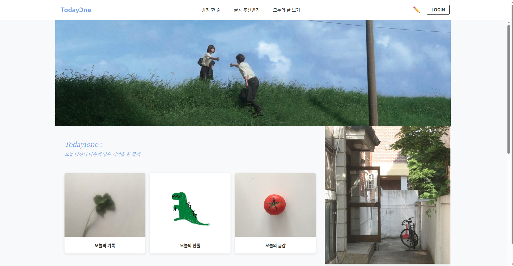
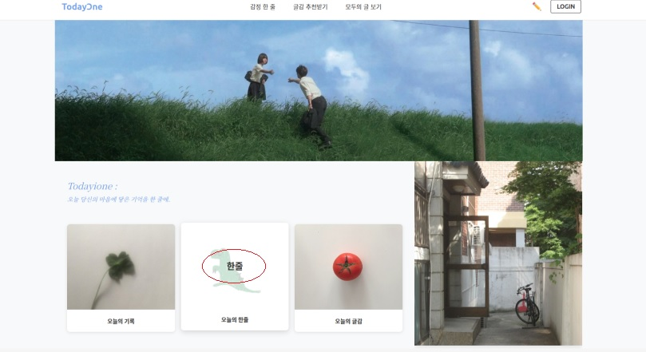
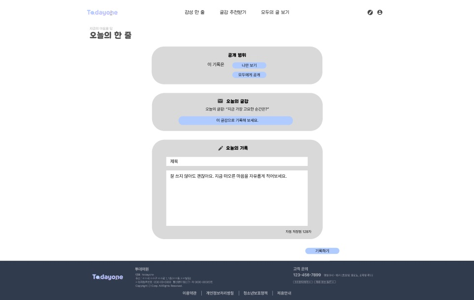
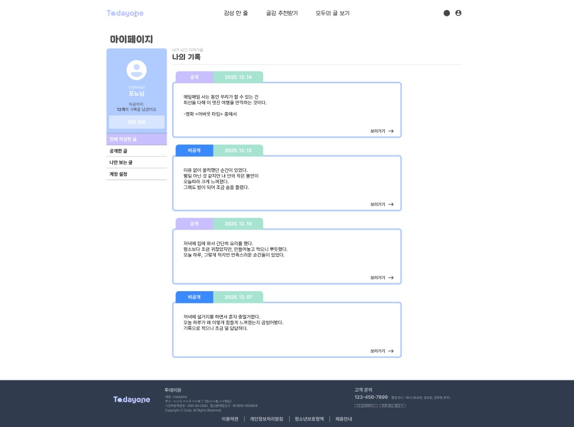
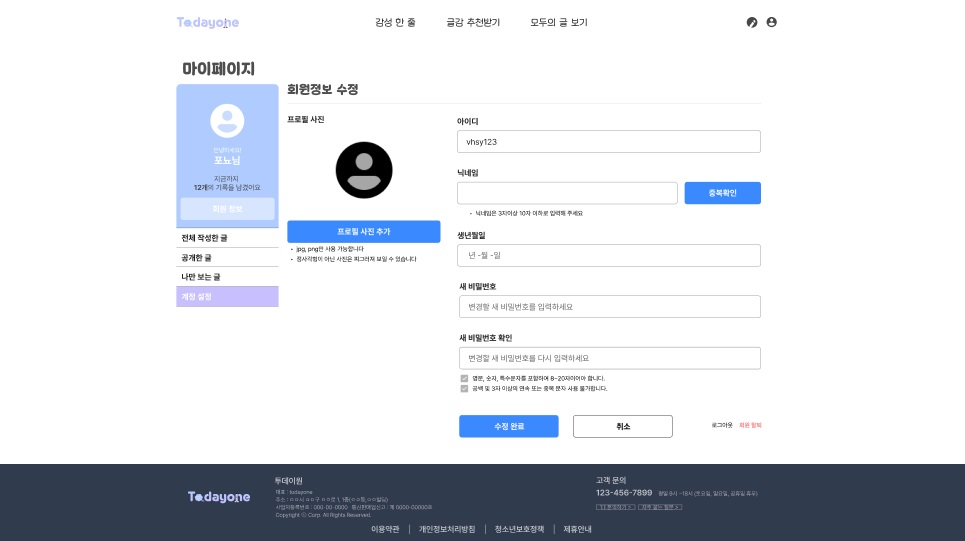
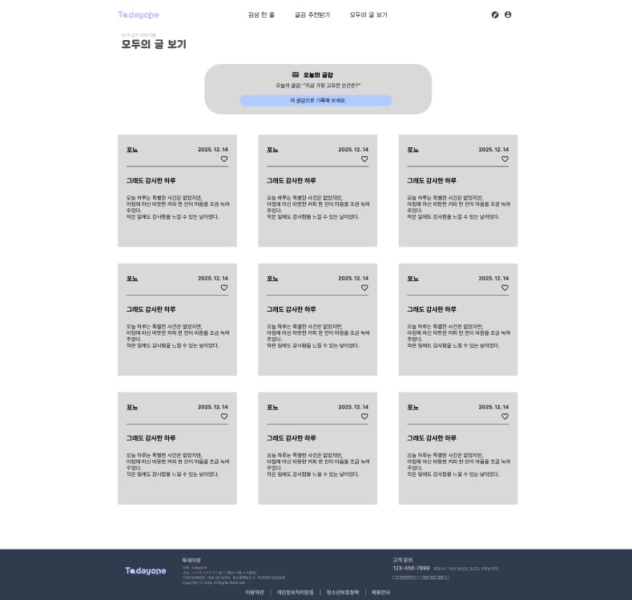
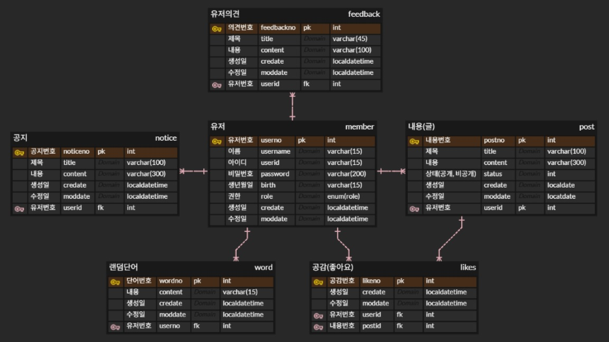
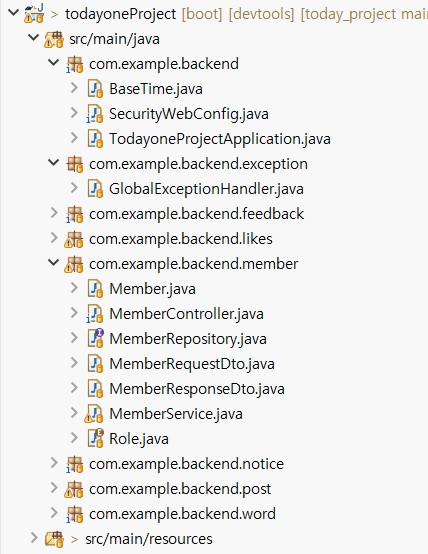

# 📝 하루 한 줄 (todayone)

게시판과 같은 성향의 부담없이 간단한 기록이 가능한 **일기 작성**을 구현하고자 한 프로젝트입니다.

---

## 🧩 1. 프로젝트 소개

- **🗓 프로젝트 기간** : 2025.12 ~ 2026.01  
- **🎯 프로젝트 목표**
  - CRUD 기반의 웹 서비스 구조 학습
  - 사용자 / 관리자 권한 설정 및 관리 기능 구현
  - 좋아요 기능을 활용하기 위해 토글 방식 구현
  
---

## 🎯 2. 기획 배경

- **매일 짧게라도 기록하는 습관 형성**
- **공개/비공개 설정으로 기록 가능**
- **글쓰기를 취미 생활로 가진 사람들에게 추천**
- **좋아요 기능을 구현해 공감을 받을 수 있음**

---

## 💡 3. 서비스 소개

**사용자 기능**

0) 회원가입, 로그인, 정보 조회, 수정, 삭제
1) 일기 (글) 작성, 조회, 수정, 삭제 (글 작성 시 공개 / 비공개 설정)
2) 다른 사람의 글에 클릭으로 좋아요 추가 (토글 방식으로 구현)
3) 건의 사항 작성 가능 (feedback)

**관리자 기능**

0) DB에서 직접 관리자 생성 or 지정
1) 사용자의 정보 조회, 수정, 삭제
2) 작성된 글의 조회, 삭제
3) 사용자들에게 보여 줄 추천 글감, 공지사항 작성

---

## 👥 4. 서비스 대상

- 🧑 **남녀노소**
- 🌱 **글쓰기 습관을 기르고 싶은, 취미인 사용자**
- 🌐 **간단한 SNS 느낌의 일기 서비스를 원하는 사용자**

---

## 🖥 5. 주요 서비스 기능 화면 및 소개

※ 프론트 미완성 부분의 화면은 피그마로 제작한 프레임으로 대체하였으며, 백엔드 기능 테스트는 완료하였습니다.

### 1-1) 첫 번째 페이지 (디자인 1)
- 상단 네비바 : 로고, 내가 작성한 글 (감성 한 줄), 글감 추천, 모두의 글 보기, 글 작성 (아이콘), 로그인 (아이콘)
- 오늘의 기록 클릭 시 : 글 작성 페이지로 이동
  - 서비스의 주제는 글 작성이 메인이기에 ui ux상 잘 나타나는 곳에 배치
- 오늘의 한 줄 클릭 시 : 랜덤으로 작성 글 하나 보여줌
- 오늘의 글감 클릭 시 : 랜덤으로 관리자가 지정한 글감 중 하나 보여줌
- 나의 기록 등

  

### 1-2) 첫 번째 페이지 (디자인 2)

  

  

### 2) 글 작성 페이지
- 공개, 비공개 설정
- 글감 추천

  

### 3) 나의 작성 글 페이지
- 공개, 비공개 설정
- 비공개 설정 글은 작성자만 확인 가능
- 조회, 수정, 삭제 가능

  

### 4) 마이페이지
- 정보 수정 (아이디는 변경 불가능)
- 추후 파일 업로드 형식 도입예정

  

### 5) 글 리스트 페이지
- 작성 시 공개로 설정된 글 전체 리스트 확인
- 상세 조회 가능
- 좋아요 버튼 (토글 방식으로 구현)  

  

### 6) 그 외
관리자 기능
- 사용자, 작성 글 관리 가능
- 사용자에게 보여 줄 글감 생성 및 관리
- 공지사항 관리

사용자 기능
- 개선사항 요청 (게시판 형식)

---

## 🛠 6. 기술 스택

### 🔹 Front-end
- HTML
- CSS
- JavaScript
- React

### 🔹 Back-end
- Java (Spring Boot)

### 🔹 Database
- MySQL

### 🔹 Development Tool
- STS4 (Spring Tool Suite 4)
- VSCode

---

## 🏗 7. 프로젝트 구조

### 🔹 ERD

  

### 🔹 구조

  

---

## 📌 마무리

하루 한 줄 기록을 통해 **글쓰기 습관 형성**과 **간단한 소셜 기능**을 제공하는 온라인 웹 서비스입니다.  
사용자 역할은 **일반 사용자**와 **관리자**로 나뉘며, 각각 역할에 맞는 권한을 설정하였습니다. 공개/비공개 글 관리, 좋아요 기능 등을 중심으로 설계되었습니다.
